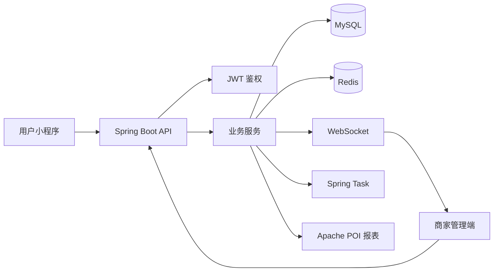

# 苍穹外卖｜多端点餐系统课程实践

[](https://www.oracle.com/java/)
[](https://spring.io/projects/spring-boot)
[](https://github.com/ptxtx/Sky-takeout/actions/workflows/build.yml)

一个面向用户小程序与商家管理后台的前后端分离点餐系统，覆盖菜品展示、购物车、用户下单、商家处理订单、实时提醒以及经营数据统计。

本仓库是黑马程序员“苍穹外卖”课程的学习实践，保留课程工程结构，并以连续提交记录展示各业务模块的实现过程，不将课程基础设计声明为个人原创。

## 完成内容

| 业务模块 | 实现内容 | 关键技术 |
| --- | --- | --- |
| 身份认证 | 用户端与商家端 JWT 鉴权、登录上下文传递 | JWT、Interceptor、ThreadLocal |
| 菜品管理 | 分类、菜品、套餐及状态管理 | Spring MVC、MyBatis、MySQL |
| 购物车与订单 | 购物车、下单、支付流程及订单状态流转 | 事务、聚合查询、定时任务 |
| 缓存 | 缓存高频访问的菜品与套餐数据 | Redis、Spring Cache |
| 实时通知 | 新订单与用户催单实时推送 | WebSocket |
| 数据统计 | 营业额、用户量、订单量和销量 Top10 | 聚合 SQL、Apache POI |
| 通用能力 | 公共字段自动填充 | 注解、反射、Spring AOP |

## 系统结构



## 关键实现

### 双端鉴权与上下文

- 用户端与商家端分别注册 JWT 拦截器。
- 鉴权成功后将当前用户 ID 保存到 ThreadLocal，供业务层获取。
- 通过自定义注解、反射和 AOP 自动填充创建人、更新人及时间字段。

### 缓存与实时提醒

- 使用 Redis 缓存菜品和套餐数据，降低重复查询。
- 通过 WebSocket 向商家端推送新订单和用户催单消息。
- 使用 Spring Task 处理超时订单及状态异常场景。

### 经营报表

- 使用聚合 SQL 统计营业额、订单量、用户量与销量排名。
- 基于 Apache POI 将统计结果写入 Excel 模板并导出。

## 技术栈

- Java 11、Spring Boot 2.7、Spring MVC
- MyBatis、MySQL、Druid
- Redis、Spring Cache
- JWT、WebSocket、Spring Task
- Knife4j、Apache POI
- Maven

## 自动构建验证

GitHub Actions 会在向 `main` 分支推送以及 Pull Request 中使用 JDK 11 完成 Maven 构建，验证三个模块能够编译并生成可执行服务包。

## 模块说明

| 模块 | 职责 |
| --- | --- |
| `sky-common` | 通用常量、异常、工具类和基础配置 |
| `sky-pojo` | Entity、DTO、VO |
| `sky-server` | Controller、Service、Mapper 及应用入口 |

## 本地运行

### 环境要求

- JDK 11
- Maven 3.8+
- MySQL 8
- Redis 6+

### 1. 准备本地配置

复制示例配置：

```bash
cp sky-server/src/main/resources/application-dev.example.yml \
   sky-server/src/main/resources/application-dev.yml
```

填写本地数据库、Redis、对象存储和微信小程序配置。实际密钥不得提交到仓库。

JWT 密钥通过环境变量传入：

```bash
export SKY_JWT_ADMIN_SECRET='replace-with-a-long-random-secret'
export SKY_JWT_USER_SECRET='replace-with-a-long-random-secret'
```

### 2. 准备数据库

创建 `sky_take_out` 数据库并导入课程配套 SQL 数据。数据库脚本未包含在本仓库中。

### 3. 构建并运行

```bash
mvn clean package -DskipTests
java -jar sky-server/target/sky-server-1.0-SNAPSHOT.jar
```

服务默认运行在 `http://localhost:8080`，Knife4j 接口文档地址为 `http://localhost:8080/doc.html`。

## 项目来源与说明

本项目用于学习 Java Web 后端开发和完整业务链路。基础需求、数据库设计与前端资源来源于黑马程序员“苍穹外卖”课程；个人实践范围以本 README 的“完成内容”和仓库提交记录为准。
